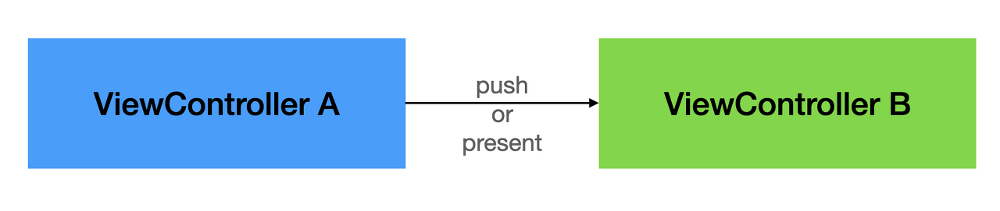
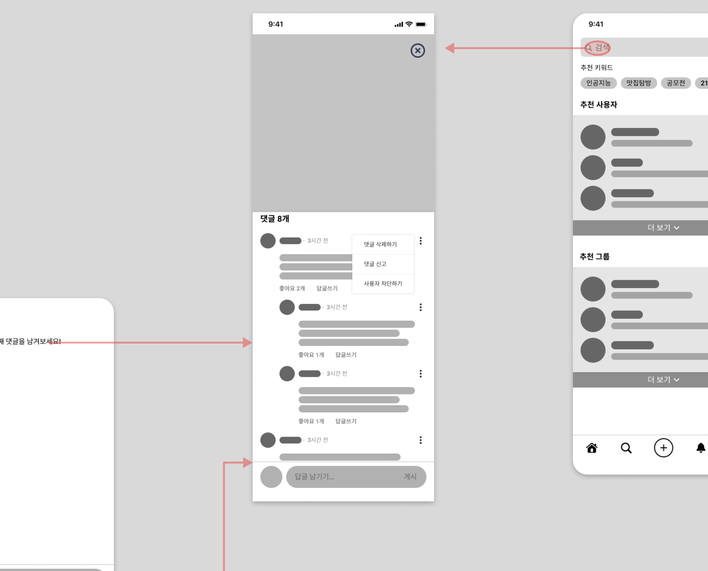
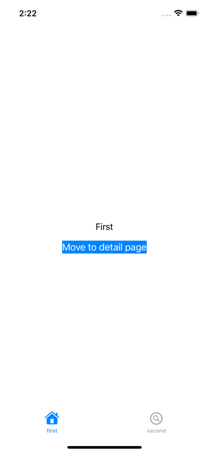

## Overview


Coordinator 가  등장한 이유와 무엇을 해결 하려 하였으며, 적용 후 어떤 부분이 개선 되었는지를 같은 기능을 Coordinator 적용 유/무 두 가지로 구현하여 확인해 보도록하겠습니다. 


### Coordinator 의 필요 배경 

Coordinator 이전에도 지속적으로 해결하고자 한 문제점 들은 ViewController 가 많은 책임을 지는 것을 해결하고자 하는 노력이 있었습니다. 
MVVM 은 ViewController 에서 Data 상태 관리를 분리 시키려고하였고, MVC 또한 ViewController 의 역할을 덜어주려 하였습니다. 

<br>

따라서 Coordinator 또한 ViewController 의 역할을 덜어주려 한다는 것에서 시작합니다. 
그 중 Coordinator 는 ViewController 에서 **화면 전환** 에 대한 책임을 덜어주는 패턴 입니다. 이로 인해 ViewController 가 UI 를 그리는 것에만 집중할 수 있게 하는 노력에 힘을 실어주는 것입니다.

<br>

기존의 화면 전환의 방식은 UINavigationController 의 pushViewController 메서드를 실행시켜 이동 시킬 대상 ViewController B 를 파라미터로 등록해줌으로써 구현하였습니다. 
이 때문에 ViewController A 는 ViewController B 를 인지하게 되며, 의존성이 생기게 됩니다. 

<br>


*기존의 화면 전환의 방식*

<br>

또한 하나의 페이지로의 이동이 여러 페이지에서 진입점을 가지고 있을 경우, 즉 다양한 경로로 동일한 페이지로 이동하는 경우 
로직의 수정이 일어날 경우 각각의 ViewController 에서 구현되어 있기에 각각의 ViewController 를 수정해줘야 하는 상황이 생깁니다. 

<br>


*다양한 경로의 화면 진입점*


<br/>
위의 방식이 가지고 있는 문제점을 정리해 보면
<br/>

* ViewController 에서 UI 를 그리는 로직과 화면 전환 로직 모두를 가지고 있어 비대해진다.
* 이동 연결이 있는 ViewController 간의 의존성이 심해진다. 
* 특정 페이지로의 화면 전환 로직이 각각의 ViewController 에 흩어져 있기에, 관리가 어렵다. 

<br>


*Coordinator 를 통한 화면 전환*

<br>

따라서 Coordinator 를 통해서 ViewController 에서 화면 전환에 대한 로직을 분리시킴으로써 
* ~~ViewController 에서 UI 를 그리는 로직과 화면 전환 로직 모두를 가지고 있어 비대해진다.~~
  -> 화면 전환에 대한 로직을 Coordinator 가 담당하므로써 ViewContorller 는 UI 가 집중할 수 있게 됩니다. 
  
* ~~이동 연결이 있는 ViewController 간의 의존성이 심해진다.~~
  -> Coordinator 를 통해 Navigation 을 구현함으로써 ViewController 는 Coordinator 만을 인지하게 됩니다. 이는 한 화면에 여러 이동 진입점이 있을 경우 더욱 유용합니다. 
  
* ~~특정 페이지로의 화면 전환 로직이 각각의 ViewController 에 흩어져 있기에, 관리가 어렵다.~~
  -> 각각의 진입점에 해당하는 ViewController 에서 이동 대상이 되는 ViewController 의 Coordinator 를 통해 화면 전환이 일어나기에 관리에 용이합니다. 


## In Action
---

FirstTab 에서와 SecondTab에서 버튼 클릭을 통해 동일한 DetailView 로 이동하는 과정을 Coordinator 도입 이전과 이후로 구현해 보면서 Coordinator 가 해결한 점을 확인해 보도록 하겠습니다. 


*구현해 볼 화면*

### NoCoordinator

아래와 같이 Coordinator 없이 구현할 경우 UINavigationController 에 이동 대상 ViewController (DetailViewController) 를 등록해 주어야 하기 때문에 ViewController 간의 의존성이 생기게 됩니다. 

<br>

또한 각각의 First, Second ViewController 에서 DetailViewController 로 직접적으로 화면 전환을 시켜주기에 진입점의 관리가 각각의 ViewController 에서 이루어지게 됩니다. 

```swift
// in 진입점 ViewController...

class NoCoordinatorFirstVC: UIViewController{
	...

    override func viewDidLoad() {
        super.viewDidLoad()
        confifureUI()
    }
    
    func confifureUI() {
		...
		
		button.addTarget(self, action: #selector(buttonPressed), for: .touchUpInside)
    }
    
    @objc private func buttonPressed() {
        // MARK: setup page router
        let detailViewController = DetailViewController()
        // MARK: push to page
        self.navigationController?.pushViewController(detailViewController, animated: true)
    }
}

```

```swift
// in 진입점 ViewController...

class NoCoordinatorSecondVC: UIViewController{
	...

    override func viewDidLoad() {
        super.viewDidLoad()
        confifureUI()
    }
    
    func confifureUI() {
		...
		
		button.addTarget(self, action: #selector(buttonPressed), for: .touchUpInside)
    }
    
    @objc private func buttonPressed() {
        // MARK: setup page router
        let detailViewController = DetailViewController()
        // MARK: push to page
        self.navigationController?.pushViewController(detailViewController, animated: true)
    }
}

```


### Apply Coordinator

Coordinator 는 일반적으로 protocol 로 구현하며 **start** method 를 가지고 있습니다.

<br>

start() 에서는 Coordinator 가 화면 전환을 역할 해주기에 전환될 대상 ViewController 에 대한 초기화, 나아가 MVVM 패턴에서는 ViewModel 에 대한 초기화 설정 등의 화면 전환 이전 시점에서 실행한 로직에 필요한 기능을 수행합니다. 

```swift
protocol Coordinator {
    func start()
}
```


진입점이 존재하는 Coordinator 에서는 화면 전환이 이루어져야 되기 때문에 rootViewController 를 UINavigationController 로 사용하며, 초기 viewController 를 등록해 줍니다. 

```swift
class FirstCoordinator: Coordinator {
    var rootViewController = UINavigationController()
    lazy var firstViewController = FirstViewController()
    
    func start() {
        self.rootViewController = UINavigationController(rootViewController: self.firstViewController)
    }
}

...SecondCoordinator 동일

```


Coordinator 를 통하여 아래와 같이 구현하게 되면, 화면 전환 로직에 대한 처리를 Coordinator 에게 넘기게 됨으로써,

1. DetailViewController 즉 전환 대상 ViewController 에 대한 의존성이 끊어지게 됩니다.
2. 진입점에 대한 화면 전환 로직 관리를 Coordinator 에서만 가능함으로써 ViewController 가 UI 에만 집중 할 수 있게 됩니다.

```swift
// in 진입점 ViewController...

class FirstViewController: UIViewController{
	lazy var coordinator = DetailCoordinator()
	
	...

    override func viewDidLoad() {
        super.viewDidLoad()
        confifureUI()
    }
    
    func confifureUI() {
		...
		
		button.addTarget(self, action: #selector(buttonPressed), for: .touchUpInside)
    }
    
    @objc private func buttonPressed() {
        if let nvc: UINavigationController = self.navigationController {
            coordinator.pushToDetail(navigationController: nvc)
        } else { return }
    }
}

```


이후엔 Coordinator 를 childCoordinator, parentCooridnator 를 통하여 고도화하여 사용하는 방법을 알아보도록 하겠습니다. 