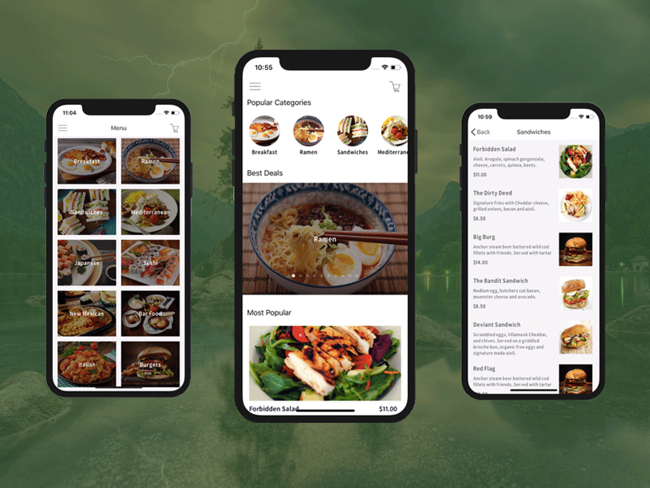

## Overview
---

의존성이란 프로그래밍을 통해 product 를 개발할 때 하나하나의 분리된 기능들이 상호 의존관계를 가지며 개발되는 과정에서의 관계를 의미합니다. 

홈 화면에 진입시 홈 화면에 필요한 데이터가 무엇인지 판단하는 기능에 의존하게 되고, 필요한 데이터를 서버에 요청하는 기능에 의존하게 됩니다. 

이렇듯 상호 의존성이 생기며 개발되는 상황에서 생기는 문제점이 무엇이며, 해당 문제점을 해결하기 위해서 의존성 주입이 하는 역할이 무엇인지 이해해 보도록하겠습니다. 

### 의존성 주입

Dependency Injection (이하  DI), 즉 의존성 주입에 대해 해당 concept 을 접하게 되는 경로를 되집어 가보면 그 의미가 조금은 더 명확해진다. 

나의 경우 DI 를 제대로 이해해야겠다고 느끼게 된 계기는 **CleanArchitecture** 의 도입을 고려하면서이다. 

그 의미는 CleanArchitecture 가 이루고자하는 의존성 분리 향한 과정에서 DI 가 빈번하게 사용됨이고, 의존성 주입(DI) 는 의존성의 분리를 도와준다는 것이다 .

또 의존성 분리는 테스트 코드 작성을 고려할 때도 자주 접할 수 있는데, 이는 테스트 환경 즉, Mock 데이터로 test 하기 적합한 형태로 만드는 것을 DI 가 도와준다는 말이 될 것 같다. 

따라서 의존성 주입이란 **의존성 분리**와 **테스팅**을 도와줄 수 있다는 점은 분명한거 같다. 

## DI in playground
---

### 강한 의존성을 어떤 문제를 발생시키는가

우선 강한 의존성이란 하나의 클래스가 다른 클래스를 구체타입으로 가지고 있는 상태를 의미 합니다.  

구체타입으로 가지고 있다는 것은 다음과 같습니다. 

```swift
// MARK: 상위 클래스
class FoodRepository {
    func getFood() -> Food{
        return Food(...)
    }
}

// MARK: 위의 클래스를 의존하는 클래스
class FoodRestaurant_A {
    private let foodFactory = FoodFactory()
    func deliveryFood() {
        ...
        foodFactory.getFood()
    }
}

class FoodRestaurant_B {
    private let foodFactory = FoodFactory()
    func deliveryFood() {
        ...
        foodFactory.getFood()
    }
}
```

현 상태는 FoodRepository_A 와 FoodRepository_B가 FoodFactory를 직접 생성하여 사용하는 상태이며, 해당 상태를 의존성이 높은 상태라고 합니다. 

이런 강한 의존성을 가지는 상태는 

1. FoodFactory 에서 수정이 생기게 되면(getFood() 가 변경되는 등)  FoodRepository_A 와 FoodRepository_B 모두에서 FoodFactory의 메서드를 직접 사용하기에 오류가 발생하여, FoodFactory 를 의존하는 (현 상태에서는 인스턴스를 생성하는) 부분을 모두 찾아서 수정해주어야 하기 때문에, 코드 수정상의 복잡성이 생기는 문제를 야기 합니다. 

2. 또한 위의 FoodFactory 를 테스팅 하기 위해 아래의 TestFoodFactory 로 변경하여 사용하고자 할 경우에도 FoodRepository 들은 각자 FoodFactory 를 직접 생성하여 사용하기 때문에, FoodFactory 를 의존하는 모든 클래스 내부의 생성부에서 수정해 주어야 한다. 

```swift

class TestFoodRepository {
	func getFood() -> Food {
		return Food(...)
	}
}

// MARK: 위의 클래스를 의존하는 클래스
class FoodRestaurant_A {
    private let foodFactory = TestFoodFactory()  // 변경해줘야해..
    func deliveryFood() {
        ...
        foodFactory.getFood()
    }
}

class FoodRestaurant_B {
    private let foodFactory = TestFoodFactory() // 여기도 변경해줘야해..
    func deliveryFood() {
        ...
        foodFactory.getFood()
    }
}
```

따라서 의존하는 기능이 갖기를 기대하는 명확한 기능을 명시함과 동시에 변경가능한 기능에 유연하게 대처하기를 갈망하게 됩니다. 

### 의존성 주입은 어떻게 해결 하는가

위의 문제를 이론적인 문제로 추상화하여 다시 접근하면

1. 의존하는 기능이 갖기를 기대하는 명확한 기능을 명시함 

위의 말을 듣고 protocol 이 떠오른다면…  그냥 떠올랐다 합시다. 

특정 기능을 추상화하여 의존성을 받고 있는 클래스의 메서드가 수정되거나하는 일을 방지해야 합니다. 이를 위히여 `Eatable` 이라는 protocol 을 생성하고, 이를 채택하는 형태로 구현하여 1. 과 같이 메서드의 사용하는 모든 곳을 수정하는 일을 방지할 수 있습니다. 

```swift
protocol Eatable {
	func getFood() -> Food()
}

class TestFoodRepository: Eatable {
	func getFood() -> Food {
		return Food(...)
	}
}
```

2. 변경가능한 기능에 유연하게 대처하기

위를 위하여 클래스 내부에서 직접 생성하여 사용하는 것이 아닌 외부에서 의존하고자 하는 기능을 **주입**함으로서 해결 가능해 집니다 .

```swift
// MARK: 위의 클래스를 의존하는 클래스
class FoodRestaurant_A {
    private let foodFactory: Eatable

		func init(foodFactory: Eatable) {
				self.foodFactory = foodFactory
		}

    func deliveryFood() {
        ...
        foodFactory.getFood()
    }
}

class FoodRestaurant_B {
    private let foodFactory: Eatable

		func init(foodFactory: Eatable) {
				self.foodFactory = foodFactory
		}

    func deliveryFood() {
        ...
        foodFactory.getFood()
    }
}
```

위처럼 의존하고자 하는 기능에 대한 클래스를 주입 받는 형태로 구현하게 되면, 직접 특정 기능의 클래스를 생성하여 사용하지 않기에 **기대되는 특정 기능을 가지고** 있는 클래스(Eatable protocol 을 채택하는)로 바꿔서 주입하거나 (eg. testing 환경)하는 상황에서도

사용하고자 하는 FoodRepository 들에 의존성을 주입하는 곳에서만 변경해주면 되기에 보다 가시적이고 유연하게 변경할 수 있게 됩니다.

## DI in Action

### Condition

레스토랑 스크린에 음식 데이터를 그려주는 화면을 설계할 경우의 구현을 의존성 주입 없는 구현과 의존성 주입을 통한 구현으로 개선하는 상황을 통해 보다 product 환경, 더 나아가 CleanArchitecture 에서의 Usecase, Repository 에서 어떻게 사용되는지에 대한 이해도를 높여 봅시다.




### Implement without DI

의존성 주입이 없이 구현을 하게 되면 아래와 같이 구현될 겁니다 .

```swift
class FoodRepositoryImpli {
	func get(onCompletion: @escaping ([Food] -> ()) {
		let url = URL(string: ...)
		
		let task = URLSession.shared.dataTask(with: url) { (data, response, err) in 
			guard let data = data else { return }
			
			task,resume()
		}
	}
}

// 위의 Repository 를 의존
class FoodViewController: UIViiewController {
	private let FoodListener = FoodRepository()

	override func viewDidLoad() {
		super.viewDidLoad()
		self.FoodListener.get(onCompletion: { foods in 
			// UI setup
			configureUI(foods)
		}
	}
}
```

### Implement with DI

1. 우선 의존하고자 하는 기능에 대한 protocol 을 정의해 줍니다. 

```swift
protocol FoodReopsitory {
	func get(onCompletion: @escaping ([Food[) -> ())
}
```

2. 정의한 protocol 을 채택하는 Repository를 생성해 줍니다. 
이로 인해 해당 클래스를 의존하여 메서드를 사용하는 경우에 기대하는 메서드가 변경되거나 하는 경우를 방지할 수 있게 됩니다. 

```swift
class FoodRepositoryImpli: FoodReopsitory {
	func get(onCompletion: @escaping ([Food] -> ()) {
		let url = URL(string: ...)
		
		let task = URLSession.shared.dataTask(with: url) { (data, response, err) in 
			guard let data = data else { return }
			
			task,resume()
		}
	}
}
```

3. ViewController 부분에서 Repository 를 주입 받는 형태로 개선하여, FoodRespository protocol 을 채택하는 형태의 외부 클래스에 대해 유연하게 작동하도록 만들어 줍니다. 

```swift
// 위의 Repository 를 의존
class FoodViewController: UIViiewController {
	private let FoodListener: FoodRepository

	func init(foodRepository: FoodRepository) {
		self.FoodListener = foodRepository
	}

	override func viewDidLoad() {
		super.viewDidLoad()
		self.FoodListener.get(onCompletion: { foods in 
			// UI setup
			configureUI(foods)
		}
	}
}
```

이렇게 의존성을 주입받는 형태로 개선하게 되면, DI 를 조립해주는 DIFactory 에서

FoodRespository protocol 을 상속하는 Mock (StubFoodRepositoryImpli) 에 대해서도 쉽게 변경이 가능해 집니다. 

```swift
class StubFoodRepositoryImpli: FoodReopsitory {
	func get(onCompletion: @escaping ([Food] -> ()) {
		let foods = [Food(...)]
		onCompletion(foods)
		}
	}
}

//... DIFactory 
func StubFoodRepositoryImpli() -> FoodReopsitory {

	// MARK: 테스팅 환경에 따른 분기 처리
	let isDevelopmentOrTest = getIsDevelopmentOrTest()    
	    if isDevelopmentOrTest {
	        return StubFoodRepositoryImpli()
	    } else {
	        return FoodRepositoryImpli()
	    }
	}
```

**따라서 의존성 주입을 통해서** 의존 상태가 느슨하게 개션함으로서 

1. 변경에 대해 보다 보장된 안정성( protocol 을 채택함으로서 ) 
2. 내부에서 직접 생성하는 것이 아닌 특정 프로토콜을 채택하는 클래스를 주입받음으로 변경에 대한 유연성

을 가질 수 있게 됩니다.

> 부족한 글 읽어주셔서 진심으로 감사드리며, 잘못된 부분이나 개선점은 무심하게 라도 알려주시면 계신 방향으로 감사인사 드리겠습니다.

reference

[https://belief-driven-design.com/decouple-your-code-with-dependency-injection-77b8d39cc93/](https://belief-driven-design.com/decouple-your-code-with-dependency-injection-77b8d39cc93/)

[https://ios-development.tistory.com/612](https://ios-development.tistory.com/612)

[https://eunjin3786.tistory.com/115](https://eunjin3786.tistory.com/115)
