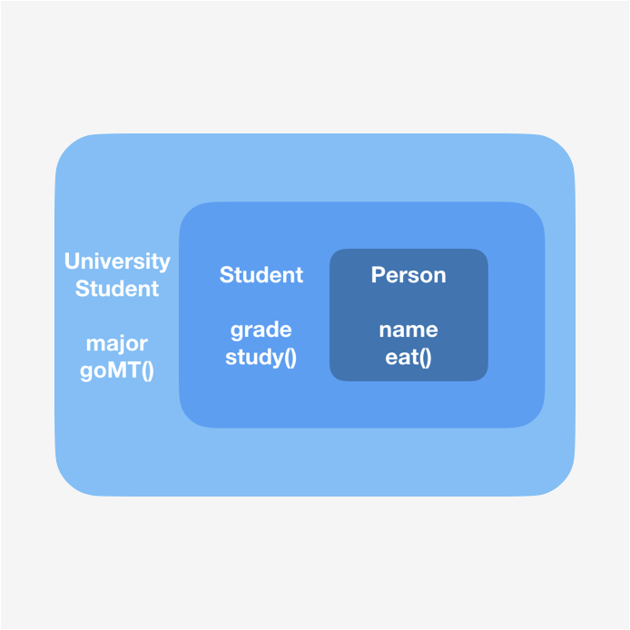

swift 의 특징 중에 하나라면 protocol 지향 언어라고 할 수 있다. 하지만 그 뜻과 의미를 이해하기 쉽지 않으며, 개념과 구현 방법을 이해 했다 하더라도 해당 기능이 무엇을 위해 존재하는지를 파악하기 전에 온전히 이해하기가 힘듭니다.

따라서 Protocol 의 개념과 protocol 이 사용되는 대표적인 delegate pattern 을 playground 에서 구현해보고, 실제로 앱을 구현할 때 delegate 를 사용하는 UITextFieldDelegate 를 구현해 봄으로써, Protocol 에 대한 이해도를 높여보겠습니다. 

1. Protocol?
2. Delegate in playground
3. Delegate in action


## Protocol? 
---

protocol 에 대해서 완벽하게 이해하기 위해서는 생각보다 깊은 내용을 요구하기에 사용하기 위한 수준에서의 이해를 하도록 하겠습니다. 


Protocol 은 class 의 한계점을 보안하는 기능을 다수 가지고 있습니다. 
Protocol 이 개선한 class 의 한계점이란 대표적으로 **상속의 단점**이 있습니다. 

#### 상속의 단점

1. 기본적으로 높은 추상화와 재활용성을 위한 상속 구조는 반대로 자식으로 갈 수 록 사용하지 않는, 즉 불필요한 (사용하지 않은 속성, 메서드 등 ) 메모리를 많이 차지하는 구조로 따라 갈 수 있습니다. 

2. swfit 에서는 다중 상속이 불가능하기에, extension 등을 통해서 기능을 확장해 나가고, 이로 인해 비대해진 클래스는 자식 클래스에 상속 될 때 또다시 위의 불필요한 기능 상속을 유발 할 수 있습니다. 



*비대해지는 상속구조 refer: https://www.hohyeonmoon.com/blog/swift-inheritence-polymorphism*


#### 수평적인 확장

위에서 정리한 상속의 한계점을 보안하는 기능의 연장선에서, protocol 은 상속이 갖는 수직적인 기능 확장 구조에 비교되어 **수평적인 확장**이 가능합니다. 


protocol 은 다음과 같이 실질적인 구현없이, 규약의 정의만으로 구현이 가능합니다. 

```swift
protocol ourPromise {
	var promise1: String
	var promise2: Int

	func getPromise(name: String) -> String
}
```

따라서 상속에 비해 상속 구조, 다중 상속에 비교적 자유롭게 확장이 가능합니다. 


그래서 프로토콜은...


프로토콜을 보통 "규약", "약속" 등으로 정의하곤 합니다. 이는 프로토콜이 구현 없이 규약 속성, 메서드의 정의를 하기 때문이기도 하지만, 

위 처럼 정의하는 근본적인 이유는 

*어떠한 프로토콜을 채택했을 땐 해당 프로토콜이 가지고 있는 기능을 반드시 가지고 있을것*

이라는 기대감 에서 나온다고 생각합니다. 


Protocol 이 가지는 위의 기능적 기대감에 의한 정의를 가장 잘 구현한 것이 Delegate 이기 때문에 Delegate 를 통해 위의 의미를 구현해 보겠습니다. 


## Delegate in playgroun다
---

delegate 는 위임하다 등의 의미를 갖는데 해당 내용으로 이해하기에는 어려움이 있습니다. 

delegate 는 기본적으로는 **객체간의 커뮤니케이션**을 가능하게 해주며, 더 나아가 다른 객체A 의 행동에 대한 구현을 객체 B 가 해준다는 것입니다. 

이에 대한 예시 중 앨런님의 예시를 통해 이해해 보도록 하겠습니다. 


1. 프로토콜을 정의해 줍니다. 
원하는 **행동** / 기능에 대한 정의를 해주며, 하는 주체가 누구인가가 아닌 하고자 하는 기능에 대한 구현을 진행해 줍니다.

아래 처럼 1. 볼륨 업 2. 볼륨 다운 이라는 두 가지 기능을 규약합니다. 

```swift
protocol RemoteDelegate {
	func volumnUp()
	func volumnDown()
}
```


2. 실질적으로 행동해 줄 클래스를 구현합니다. 
delegate 를 통해 해당 delegate를 채택하고 있는 객체의 행동을 구현해줍니다. 


```swift
class Remote {

	var delegate: RemoteDelegate?

	// 해당 구현체에서는 굳이 Delegate 의 함수명을 따를 필요 없음
	func 리모콘_볼륨업_버튼() {
		delegate?.volumnUp()
	}
	
	func 리모콘_볼륨다운_버튼() {
		delegate?.volumnDown()
	}
}
```


3. 위 구현체의 행동 대상이 되는 클래스를 구현 합니다. 
delegate 를 채택하여 해당 delegate 가 가지고 있는 행동에 대해서 구현해줍니다. 


```swift
class TV: RemoteDelegate {

	// 해당 구현체에서는 delegate 를 채택하였기에 채택한 delegate 규약을(함수명) 따라야 한다. 
	func volumnUp() {
		print("volumn up")
	}

	func volumnDown() {
		print("volumn up")
	}
}
```


final.

```swift
let remote = Remote()
let smallTV = TV()

remote.리모콘_볼륨업_버튼()
```


위의 구현은 **smallTV 라는 객체의 음량조절**하기 위한 일차적인 구현목표의 delegate 패턴으로의 구현입니다. 

1. 음량 조절이라는 기능 정의 (Protocol)
2. 음량 조절을 명령/기능 해줄 클래스 - 리모콘의 업/다운 버튼 (Remote: delegate method 구현, 대리인)
3. 음량 조절 결과를 받을 클래스 (TV: delegate 채택을 통한 해당 기능 구현 필요)

따라서 단순히 TV 에서 모두 정의 되고, 확장되어야 할 TV 가 행해야할 기능들을 remote, 스피커 등으로  기능을 위임가능 함으로써 TV 가 가지게 될 복잡성과 확장 가능성을 달성할 수 있게 됩니다. 


또한, 위처럼 기능 단위의 확장과 해당 기능(음량 조절)에 대한 자세한 구현은 TV, 스마트폰  등으로 확장가능하기에 

* 기능(규약)의 정의 
* 구체적인 구현을 미루는

Protocol 이 갖는 강점을 비로소 체감할 수 있게 됩니다. (그리고 나름 고심한 썸네일의 의미두염...)


위의 *smallTV 라는 객체의 음량조절* 기능을 delegate 패턴을 뜯어보며, 

* delegate 가 왜 위임자, 대리자 개념으로 설명되는지
* delegate 가 왜 protocol 로 구현되어야 했는지

가 delegate 의 역할과 protocol 로 구현 된 이유에 관점에서 이해가 되셨으면 좋겠습니다. 


