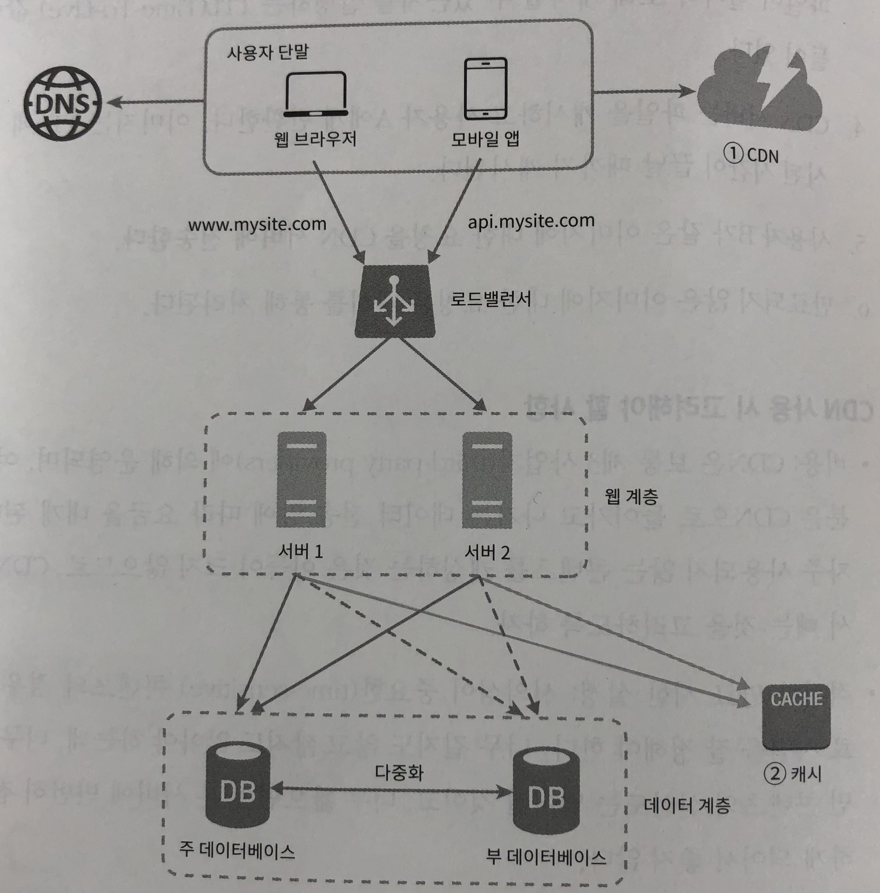

## static ?
---

명확한 장점으로 인해 성능을 고도화를 위해 쉽게 고려 되지만, 다양한 경로에서 야기될 수 있는 문제점으로 인해  
모르면 쓰지마라  
중론이 되는 개념 중 하나 인 것 같다.   

보다 그 이점과 주의점을 명확하게 하여, 적재적소에 사용하고자 정리해보도록 하자  
(무서워서 안 쓸 수는 없다...)

### 개념
_static : 정적인,움직이지 않는_ 

크게 와닿진 않되, 왜 그렇게 썻는지는 알 것 같은 단어이다. 

클래스에서 static 으로 선언한 변수는 찍어낸 객체에서 존재하는 변수가 아닌, 클래스 주소에 위치 한 클래스 변수이다.  
이 말인 즉슨, 해당 클래스의 생성자로 찍어낸 모든 객체가 동일한 주소의 클래스 변수를 참조한다는 의미이다.   

해당 개념을 확인해 보기 위해 주로 사용되는 코드는 아래와 같다.  

```java
class StaticSample {
        public static int val = 0;

        public static void main(String [] args) {
                StaticSample sam1 = new StaticSample();
                sam1.val++;

                StaticSample sam2 = new StaticSample();
                sam2.val++;

                System.out.println(sam1.val);
                System.out.println(sam2.val);
        }
}
```


해당 개념으로 부터 확인 할 수 있는 static 의 명확한 장점은   
**중복되는 변수, 객체의 메모리 할당을 방지 할 수 있다**
는 점이다.  

이로 인한 메모리 관점의 이점 외에도 기능적인 이유로도 사용되기도 한다.   

만약 여러 클래스에서 공통적으로 사용 될 수도 있는이 아니라, 공통으로 사용해야만 하는 데이터 들에 대해 (eg. 사용자 session 등)  
구현 할 때도 고려된다. 

해당 기능을 구현하기 위한 패턴이 **Singleton pattern** 이다.   

> 클래스 내부의 static 변수의 사용이 아닌, static class 즉, 여러 객체를 찍어 낼 수 없게 구현하기 위해서는 아래와 같이 생성자를 private 으로 접근 제어 후 내부 get... 를 통해 유일한 static 객체를 사용되게 만들 수 있다.


```java
public class Singleton {
	private static Singleton st;

	private Singleton() {}
	public static SingletonGetInstatnce() return st; 
	...
}	
``` 

> static method 는 
> 1. 객체를 생성하여 호출 할 필요가 없이, 클래스 명을 통해 호출이 가능하다.     ( eg. `Singleton.SingletonGetInstatnce()`)
> 2. 같은 클래스를 통해 생성된 객체들 간 같은 메서드를 참조하는 것을 보장하기 위해 사용 (Override 가 불가능 한 이유이다.)


## 왜 주의 해야 할까
---
위에서 언급된 개념을 통해 얻어진 이점이 그대로 주의점이 되어 돌아올 수 있다. 
	
언급된 개념을 다시 살펴 보자

> 클래스에서 static 으로 선언한 변수는 찍어낸 객체에서 존재하는 변수가 아닌, 클래스 주소에 위치 한 클래스 변수이다. 
> 이 말인 즉슨, 해당 클래스의 생성자로 찍어낸 모든 객체가 동일한 주소의 클래스 변수를 참조한다는 의미이다. 


### 1. 유일한 변수를 쳐다 본다. 그 유일한 변수가 수정이 일어나게 되면?

위의  StaticSample 예제 코드에서도 확인이 가능 했듯이, 찍어낸 모든 객체가  
class 메모리 주소에 존재하는 유일한 static 변수를 참조하기 때문에,  

_어디서 수정이 되었든 모든 찍어진 객체에서  사용되는 static 변수가 수정된다._ 

당연히 이를 위해서 static 변수를 사용한 것이겠지만, 명확한 의도를 이해하고, 또 이해 가능하게 작성해야 한다.  

잘못 사용된 좋은 예제가 있어 작성하였다. 

```java
public class BadQueryManager {
	private static String queryURL = null;

	public BadQueryManager(String badUrl) {
		queryURL = badUrl; 
	}

	public static String getSql(String idSql) {
		try {
			...
			reader.read(queryURL)
		} catch(Exception ex) {
			...
		}
	}
}
```

해당 코드가 야기 하는 문제는 무엇일까.  

여러 Tread 에서 해당 static url 을 사용하기 위해서, 해당 객체를 생성자(queryURL) 을 통해 찍어 getSql 을 사용하게 되면  
생성자를 통해 BadQueryManager 의 static String queryURL 이 변경 되게 되므로 시점에 따라  

**다른 Tread 에서는 영문도 모른 채 바뀐 queryURL** 을 통해 getSql 로직 결과를 반환 받게 되는 것 이다.


따라서 명확한 의도를 가지고 사용해야 하는 것이 static 이다. 

위의 경우에서도 언제나 변한 없는 값을 위한 URL 을 원하는 경우  

1. `static final` 을 통해 값의 할당이 최초에만 될 수 있게 하거나, (적어도 값의 변경을 시도 할 때 에러라도 내서 수정 할 수 있게...)
2. `private BadQueryManager` 를 통해 생성자를 막아버려 싱글톤으로 구현

할 수도  있을 것 같다. 

좌우지간 관습적으로 이럴 경우 이렇게... 식으로의 코드 작성 보다 해당 기능이 원하는 명확한 요구 사항을 파악한 후에 
올바른 코드 작성을 해야 하는 것 같다


위의 문제는 동일 JVM 에서도 발생할 수 있는 경우이다.   
하지만, MSA 를 통해 여러 대의 WAS 생성하여 수평 확장을 하는 것이 대두되는 요즘 또 다른 문제점이 발생한다. 

당연하겠지만, 
* 다른 JVM 에서는 static 이라 하더라도 다른 주소나 다른 값을 참조한다.   

이가 주는 주의점은 JVM 이 로드 되는 시점이 상이 한 환경에서   
로드되는 시점 한번에 읽어드려 static 변수로 관리하고자 하였던, 데이터의 값들이   
시점, 각 JVM 에서 이루어진 static data 수정으로 인해, JVM 별로 다를 수도 있다는 점이다.

이를 해결하기 위해서 
* static 변수의 값이 수정 될 경우 모든 서버를 재시작하는 등

을 고려 할 수 있지만, 딱 봐도 무시무시한 방법이기에 JVM 간의 static 한 변수, 데이터를 사용하기 위해서   
**캐시 서버**를 통해 확장성 있는 설계를 구성할 수 있다. 


*대규모 시스템 설계 기초 (이 책도 진짜 재밌어요...)*


### 3. GC 에서 제외된다.

static 으로 선언 시 GC 에서 제외된다는 것은, GC 가 관리 해주지 않는 다는 것이고

이는 곧 잘 못 관리 시 Memory Leak 가 발생한다는 것이다. 

따라서 static 변수가 메모리에서 차지 하는 공간을 불확실하게 둘 수 있는 자료구조를 사용하는 것을 주의해야 한다.   
그렇기에 HashMap, ArrayList 와 같이 선언 시 길이를 할당하지 않는 Collection 객체를 static 으로 선언하면
OutOfMemoryError 를 뱉어내며, 서버가 죽게 된다.

따라서 반대로 모니터링 시 계속 해서 GC 이후의 최저 메모리 사용량이 증가하게 되면 해당 문제를 의심해 볼 수도 있다.


*번외*

위의 주의점 들을 고려 할 때, 얻어 갈 수 있는 관점은  
테스트 시 단일 사용자, 단일 WAS 에서 발생하는 트래픽만을 고려하는 것이 아닌

* MSA 구조를 통해, 여러 대 올라가는 WAS 
* 당연하겠지만, 다수의 Client 에서 발생하는 접근 

을 고려하여 테스트 해봐야 한다.


> 부족한 글 읽어주셔서 진심으로 감사드리며, 잘못된 부분이나 개선점은 무심하게 라도 알려주시면 너무 감사하겠습니다.


> reference
> * [자바 성능 튜닝 이야기 - static 제대로 한번 써보자](https://product.kyobobook.co.kr/detail/S000001032977) 
> * [가상 면접 사례로 배우는 대규모 시스템 설계 기초](https://product.kyobobook.co.kr/detail/S000001033116)