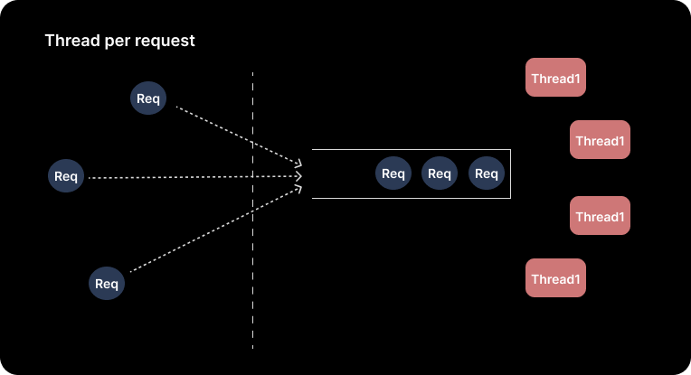
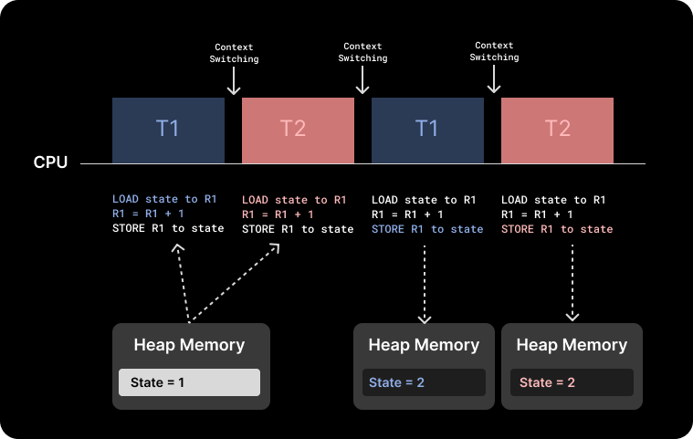
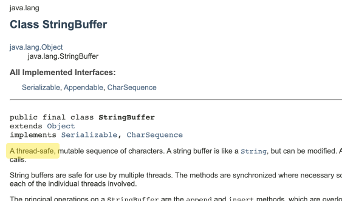
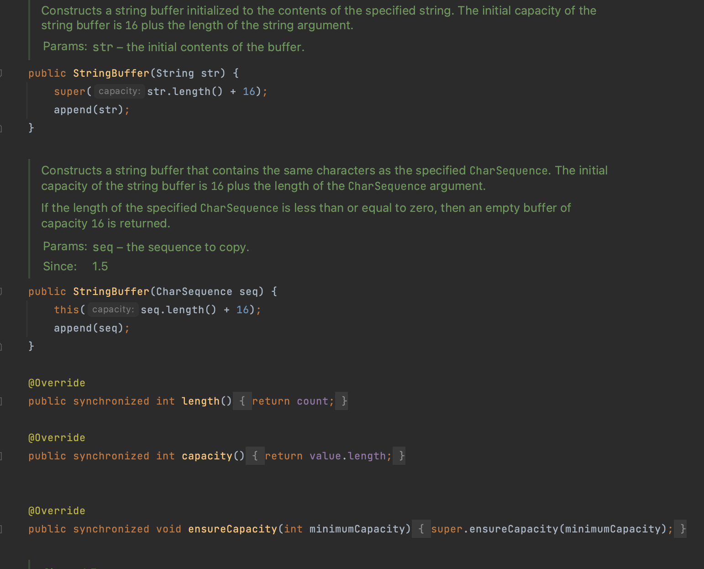

## Thread pool
---

웹 서버가 사용자의 요청들을 처리하는 여러 방법 중에 **Thread per request** 환경을 보면  
사용자의 Request 를 Queue 에 담아 논 후 Thread Pool 에서 사용이 끝난 후 반납된 Thread 에 해당 요청 작업을 수행 시키게 된다.  



*[그림1] Thread per request 에서의 처리 방식*


이러한 상황에서 여러 Thread 가 static 변수 등의 여러 Thread 와 공유하는 데이터가 존재하는  
Heap 영역에 접근해서  

_값의 수정이 일어 나게 되면_ 

과연 그 값의 수정은 개발자의 의도대로 정상 작동할까?


## 의도대로 작동하지 않는 코드
---

우선 예시로 여러 개의 Thread 가 수행되고 있는 환경에서 어떤 문제가 생길 수 있을까

통장 잔고를 확인 후 출금하고자 하는 금액(100~300 random) 보다 클 경우 출금 후 
잔여급액을 출력하는 코드를 통해 발생하는 문제를 알아보자.


1. 우선 아래와 같이 withdraw 함수를 수행하는 Accout class 를 작성해준다. 

withdraw 함수에서 잔여 금액 확인 후 조건을 만족 할 경우 Thread sleep 이후 잔여 금액에서 차감시켜 줍니다.
(Thread 를 의도적으로 sleep 시켜 Context Switching 이 발생하도록 작성해 준다.)


```java
package Thread;

public class ThreadStaticAccount {
    private static int remainMoney = 1000;

    public int getRemainMoney() { return remainMoney; }

    public static void withdraw(int money) {
        //해당 시점에서 remainMoney 값을 메모리에서 읽어온 시점에서는 아래 조건이 true 이나
        //Thread 의 Context Switching 이 발생함에 따라 데이터 값이 변동 될 수 있다.
        if (remainMoney >= money) {
            try{
                // Thread 의 처리 속도가 빨라서 sleep 을 줘서 Context Switching 이 발생하도록
                Thread.sleep(1000);
            } catch (InterruptedException e) {
                e.printStackTrace();
            }
            remainMoney -= money;
        } else {
            System.out.println("Not enough money");
        }
    }
}

```

2. Thread 를 구현하기 위한 TaskRunnable class 를 구현해 준다. 

```java
package Thread;

public class TaskRunnable implements Runnable {
    ThreadStaticAccount threadStaticAccount = new ThreadStaticAccount();
    @Override
    public void run() {
        while (threadStaticAccount.getRemainMoney() > 0) {
            int money = (int) (Math.random() * 3 + 1) * 100;
            threadStaticAccount.withdraw(money);
            System.out.println("remain Volume: " + threadStaticAccount.getRemainMoney() );
        }
    }
}
```

3. new TaskRunnable() 을 통해 Runnable 객체를 생성한 후 2개의 Thread 를 start 시켜준다.

```java
package Thread;

public class MultiThreadSyncTest {
    public static void main(String[] args) {
        Runnable run = new TaskRunnable();

        new Thread(run).start();
        new Thread(run).start();
    }
}
```

의도한 코드에 의하면 어떤 결과가 나와야 되는가?

ThreadStaticAccount 의 withdraw() 메서드 실행시 잔여금액(remainMoney)을 확인 후  
출금하고자 하는 금액(money)보다 충분하다는 조건을 통과한 후에 해당 금액을 차감한 양의 금액이 나와야 한다.  
(잔여금액을 확인 후 출금하고자 하는 금액보다 충분하다는 조건을 만족했기에)

하지만 결과는 아래와 같다.

```java
remain Volume: 700
remain Volume: 700
remain Volume: 400
remain Volume: 400
remain Volume: 200
remain Volume: 200
remain Volume: 200
remain Volume: 0
remain Volume: -100
```

어째서 위와 같은 경우가 발생하는가


## Multi Thread 의 CPU 에서의 동작
---

우리가 작성한 코드 (User level) 은 메모리 영역에서 아래와 같이 올라간다 

JVM 환경은 user thread 와 os thread (kernel thread) 는 one to one 방식으로 매핑한다.  

위 말인 즉슨 JVM 환경에서는 Thread 스케줄링은 OS 에게 위임한다는 의미이다. 

따라서 아래와 같이 각각의 Thread 가 스케줄링 될 경우, 시점에 따라서 Heap 에서 공유되어 동기화화될 것이라 
믿었던 static 변수의 값이 이전 작업 Thread 에 의해 수정이 발생할 수도 있다는 것이다.

eg. static 변수 int state 를 multi thread 환경에서 add() { state++; } 연산  


*[그림2] Cpu 관점에서 Thread Context switching 과정의 Heap memory 데이터 연산*


## JVM 환경에서의 동기화 해결책
---
[그림2] 싱황을 고려하여 앞서 살펴본 코드예제에서
static 변수를 의도대로 참고하기 위해선 값을 유지해야하는 발생하는 메서드에 synchronized 를 선언해 줌으로써 같은 상황을 방지 할 수 있다.

```java
public class ThreadStaticAccount {
    ...
    public static synchronized void withdraw(int money) {
        if (remainMoney >= money) {
		...
```

synchronized 키워드를 통해 Thread 간의 Context switching 이 발생하여 Data 의 안정성과 신뢰성을
보장할 수 있는 Thread-safe 한 환경을 만들어 줄 수 있다. 


## Thread-safe 사용 예: StringBuilder 와 StringBuffer

해당 동기화 개념이 실제로 쓰이는 사례 중 StringBuilder 와 StringBuffer의 예시가 있다. 

공식 문서 확인 시 StringBuffer 는 Thread safe 하다 라고 나와 있는 것이 


*[그림3] StringBuffer 공식 문서 (https://docs.oracle.com/javase/7/docs/api/java/lang/StringBuffer.html)*

위의 동기화 개념이 적용 된 것이다.

실제 소스 코드에서도 synchronized 를 선언해 줌으로써 StringBuffer 가 동기화에 있어서 보장해주고 있다는 것을 확인 할 수 있다. 


*[그림4] StringBuffer source code*


여기까지 Multi Thread 환경에서 발생할 수 있는 문제점과 이를 해결하기 위한 synchronized 키워드를 정리하였습니다. 

Trade-off 는 synchronized 사용시 Thread-safe 를 보장하지만, synchronized 메서드가 많을 수록 멀티스레드는 병목현상을 겪게 됩니다.

이는 멀티 스레드를 사용하지만, 싱글 스레드처럼 동작한다는 것입니다.

따라서 작성하고자 하는 코드의 목적에 적합하게 사용해야 합니다.


<br>
<br>

reference
> * [자바 성능 튜닝 이야기 - static 제대로 한번 써보자](https://product.kyobobook.co.kr/detail/S000001032977) 
> * [Java String Buffer](https://docs.oracle.com/javase/7/docs/api/java/lang/StringBuffer.html)


> 부족한 글 읽어주셔서 진심으로 감사드리며, 잘못된 부분이나 개선점은 무심하게라도 알려주시면 너무 감사하겠습니다.